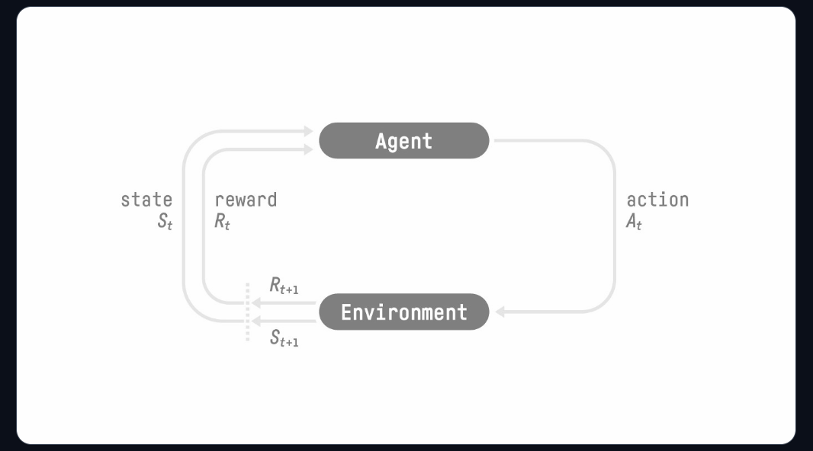
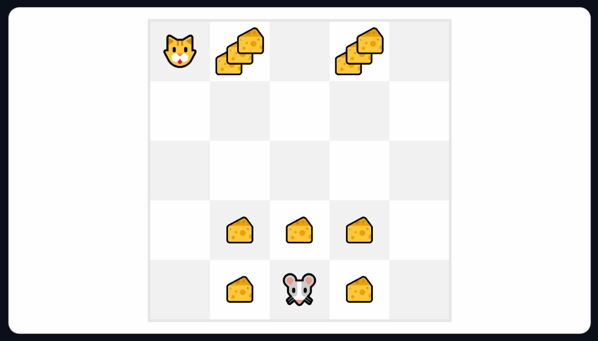
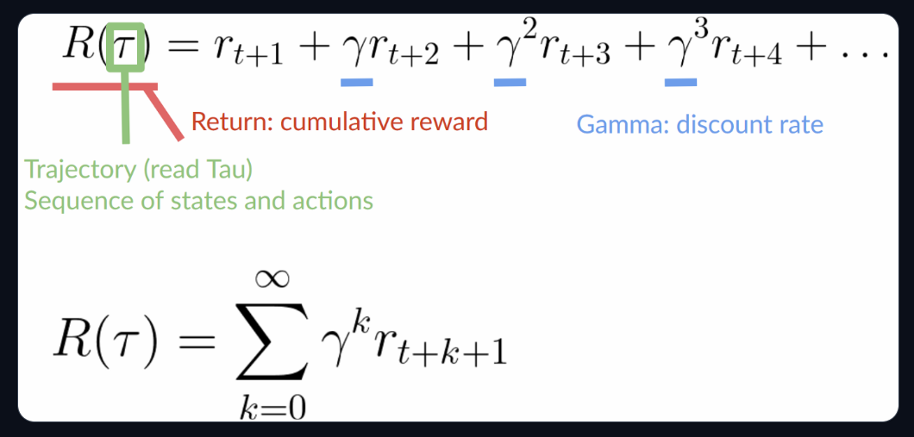

# Reinforcement_learning_notes

## Introduction

Deep RL is a type of Machine Learning where an agent learns how to behave in an environment by performing actions and seeing the results.

The idea behind Reinforcement Learning is that an agent (an AI) will learn from the environment by interacting with it (through trial and error) and receiving rewards (negative or positive) as feedback for performing actions.

Learning from interactions with the environment comes from our natural experiences.

The RL Process: a loop of state, action, reward and next state.

* Our Agent receives state S{0}from the Environment — we receive the first frame of our game (Environment).
* Based on that state S{0}, the Agent takes action A{0} — our Agent will move to the right.
* The environment goes to a new state S{1} — new frame.
* The environment gives some reward R{1} to the Agent — we’re not dead (Positive Reward +1).

This RL loop outputs a sequence of state, action, reward and next state.

The agent’s goal is to maximize its cumulative reward, called the expected return.

### Why is the goal of the agent to maximize the expected return?

Because RL is based on the reward hypothesis, which is that all goals can be described as the maximization of the expected return (expected cumulative reward).

That’s why in Reinforcement Learning, to have the best behavior, we aim to learn to take actions that maximize the expected cumulative reward.

## Markov Property

In papers, the RL process is called a Markov Decision Process (MDP).
Markov Property implies that our agent needs only the current state to decide what action to take and not the history of all the states and actions they took before.

### Observations/States Space

Observations/States are the information our agent gets from the environment. In the case of a video game, it can be a frame (a screenshot). In the case of the trading agent, it can be the value of a certain stock, etc.

There is a differentiation to make between observation and state, however:

* State s: is a complete description of the state of the world (there is no hidden information). In a fully observed environment.

* Observation o: is a partial description of the state. In a partially observed environment. In Super Mario Bros, we only see the part of the level close to the player, so we receive an observation. In Super Mario Bros, we are in a partially observed environment. We receive an observation since we only see a part of the level.

## Action Space

The Action space is the set of all possible actions in an environment. The actions can come from a discrete or continuous space:

* Discrete space: the number of possible actions is finite. Again, in Super Mario Bros, we have a finite set of actions since we have only 4 directions.

* Continuous space: the number of possible actions is infinite. A Self Driving Car agent has an infinite number of possible actions since it can turn left 20°, 21,1°, 21,2°, honk, turn right 20°…

Taking this information into consideration is crucial because it will have importance when choosing the RL algorithm in the future.

## Rewards and the discounting

The reward is fundamental in RL because it’s the only feedback for the agent. Thanks to it, our agent knows if the action taken was good or not.

The cumulative reward at each time step t can be written as:
R(T) = r(t+1) + r(t+2) + r(t+3) + ....

However, in reality, we can’t just add them like that. The rewards that come sooner (at the beginning of the game) are more likely to happen since they are more predictable than the long-term future reward.

Let’s say your agent is this tiny mouse that can move one tile each time step, and your opponent is the cat (that can move too). The mouse’s goal is to eat the maximum amount of cheese before being eaten by the cat. 

As we can see in the diagram, it’s more probable to eat the cheese near us than the cheese close to the cat (the closer we are to the cat, the more dangerous it is).

Consequently, the reward near the cat, even if it is bigger (more cheese), will be more discounted since we’re not really sure we’ll be able to eat it.

To discount the rewards, we proceed like this:

1. We define a discount rate called gamma. It must be between 0 and 1. Most of the time between 0.95 and 0.99.
* The larger the gamma, the smaller the discount. This means our agent cares more about the long-term reward.
* On the other hand, the smaller the gamma, the bigger the discount. This means our agent cares more about the short term reward (the nearest cheese).
2. Then, each reward will be discounted by gamma to the exponent of the time step. As the time step increases, the cat gets closer to us, so the future reward is less and less likely to happen.

Our discounted expected cumulative reward is:

## Type of tasks

A task is an instance of a Reinforcement Learning problem. We can have two types of tasks: episodic and continuing.

### Episodic task

In this case, we have a starting point and an ending point (a terminal state). This creates an episode: a list of States, Actions, Rewards, and new States.

For instance, think about Super Mario Bros: an episode begins at the launch of a new Mario Level and ends when you’re killed or you reached the end of the level.

### Continuing tasks
These are tasks that continue forever (no terminal state). In this case, the agent must learn how to choose the best actions and simultaneously interact with the environment.

For instance, an agent that does automated stock trading. For this task, there is no starting point and terminal state. The agent keeps running until we decide to stop it.